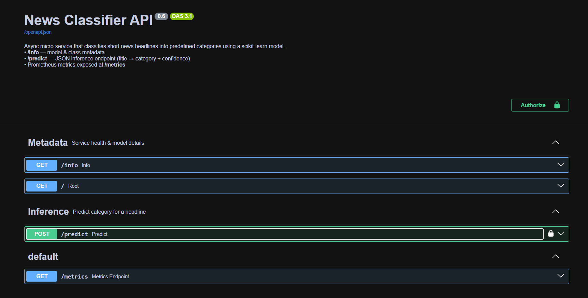
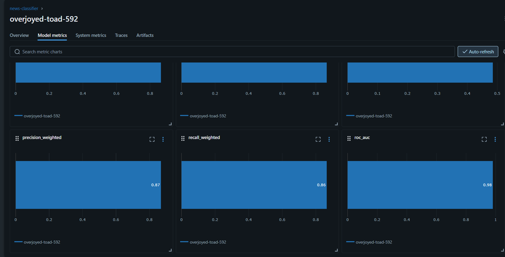
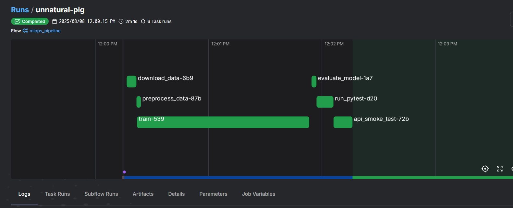
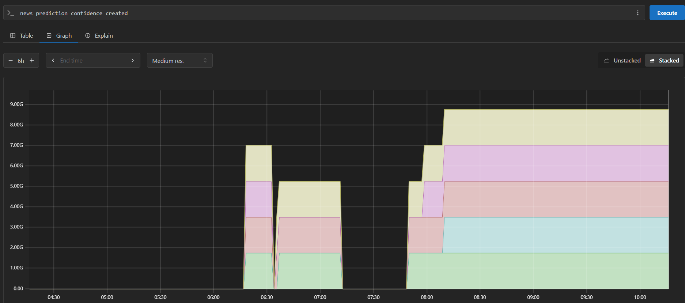
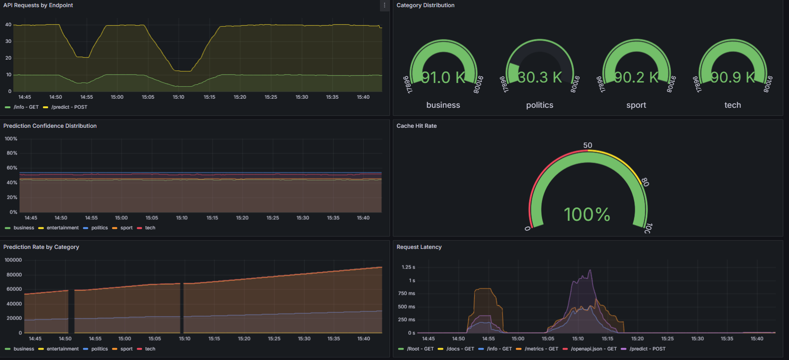
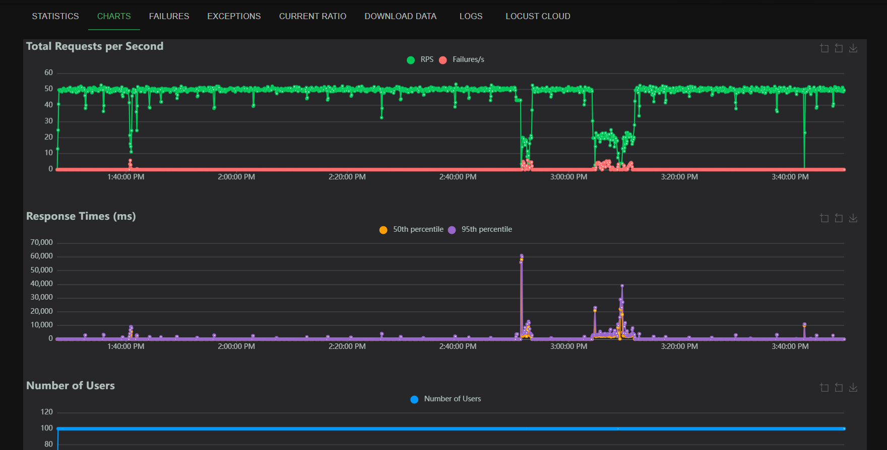

# News Classification — End-to-End MLOps (BBC News)

An opinionated, reproducible MLOps stack for training, serving, and monitoring a text-classification model on the **BBC News** dataset (Kaggle). The stack includes FastAPI, Prefect, MLflow, Prometheus, Grafana, and Locust, with Docker Compose and Kubernetes manifests for one-command deployment.

---

## Dataset

- **BBC News Articles (Kaggle)** — 5 topical classes of news stories.
- Access via Kaggle API:
  1. Create a Kaggle token from your Kaggle account (Account → API → Create New Token).
  2. Put `KAGGLE_USERNAME` and `KAGGLE_KEY` in your `.env` (see **Configuration**).
- Raw data is stored under `data/raw/`. Preprocessing scripts live in `src/data/`.

---


## Model Training & Evaluation

We train and evaluate three classical baselines:

- **Logistic Regression**
- **Support Vector Machine (SVM)**
- **Random Forest**

All models use the same preprocessing pipeline (tokenization/TF-IDF).  
During evaluation, we compute **accuracy, F1, precision, and recall**, log confusion matrices, and compare runs in **MLflow**.  
The best model (by F1) is promoted to “production” and served by FastAPI.


---

## Tech Stack

| Tool / Framework   | Purpose |
|--------------------|---------|
| **Python**         | Core programming language |
| **FastAPI**        | Model serving, API endpoints, and documentation UI |
| **Prefect**        | Orchestration of data ingestion, training, evaluation |
| **MLflow**         | Experiment tracking, model registry |
| **Prometheus**     | Metrics scraping from FastAPI and exporters |
| **Grafana**        | Visualization of Prometheus metrics |
| **Locust**         | Load testing of prediction endpoint |
| **Docker Compose** | Local container orchestration |
| **Kubernetes**     | Deployment of all services in a cluster |
| **scikit-learn**   | ML model training & evaluation |
| **TF-IDF Vectorizer** | Text feature extraction |
| **Kaggle API**     | Dataset download and access |

---

## Directory Structure

```bash
.
├── src/
│   ├── api/          # FastAPI app (routes, schemas, templates/)
│   ├── data/         # Ingestion & preprocessing scripts
│   ├── models/       # Model defs, train/eval, inference
│   └── pipelines/    # Prefect flows (training, evaluation, batch jobs)
├── configs/          # Prometheus, Grafana, MLflow, etc.
├── k8s/              # Kubernetes manifests
├── notebooks/        # EDA and experiments
├── tests/            # Unit/integration/load test scaffolding
├── data/
│   └── raw/          # Raw datasets (BBC news)
├── images/           # Documentation screenshots (add your own)
├── docker-compose.yml
├── Dockerfile
├── requirements.txt
├── .env.example
└── LICENSE
```

---

## Architecture

The following diagram illustrates the high-level architecture of the system:

<p align="center">
  
</p>

---

## Services Overview

### Home (FastAPI UI)
- Interactive OpenAPI docs (`/docs`) and minimal HTML home.
- Endpoints:
  - `GET /info` — service health & metadata
  - `POST /predict` — classify a news snippet
  - `GET /metrics` — Prometheus metrics  


<p align="center">
  
</p>


### MLflow
- Experiment tracking, metrics, params, artifacts, model registry.
- Compare LR vs SVM vs RF, register the best model.  
<p align="center">
  
</p>

### Prefect
- Orchestrates ingestion → training → evaluation → registration flows.
- Trigger flows manually or on schedule.  
<p align="center">
  
</p>

### Prometheus
- Scrapes `/metrics` from API and other exporters.  
<p align="center">
  
</p>

### Grafana
- Dashboards for API latency, error rate, throughput, and model metrics.  
<p align="center">
  
</p>

### Locust
- Load testing for `/predict` endpoint.  
<p align="center">
  
</p>

---

## Default Ports

**Docker Compose:**
- FastAPI: **http://localhost:7860**
- MLflow: **http://localhost:5000**
- Prefect: **http://localhost:4200**
- Prometheus: **http://localhost:9090**
- Grafana: **http://localhost:3000**
- Locust: **http://localhost:8089**

**Kubernetes (NodePort defaults):**
- API: **http://localhost:30760**
- MLflow: **http://localhost:31500**
- Prefect: **http://localhost:31200**
- Prometheus: **http://localhost:30900**
- Grafana: **http://localhost:32000**
- Locust: **http://localhost:32089**

---

## Configuration

**Copy env file:**
```bash
cp .env.example .env
```

**Set required values:**
```env
API_KEY=change_me
CACHE_TTL=3600
KAGGLE_USERNAME=your_kaggle_username
KAGGLE_KEY=your_kaggle_api_key
```

**Install Python dependencies (optional for local runs):**
```bash
python -m venv .venv && source .venv/bin/activate
pip install -r requirements.txt
```

---

## Running with Docker Compose

```bash
docker compose up -d
docker compose logs -f api
docker compose down
```

---

## Running with Kubernetes

```bash
kubectl apply -f k8s/all-in-one.yaml
kubectl get svc
```

**To remove:**
```bash
kubectl delete -f k8s/all-in-one.yaml
```

---

## Local API Smoke Test

```bash
curl -X POST "http://localhost:7860/predict"   -H "Content-Type: application/json"   -d '{"text": "The government unveiled a new policy today..."}'
```

---

## CI/CD & Testing

- **Unit/Integration:** `tests/`
- **Load:** Locust UI (`:8089`)
- **Optional CI:** GitHub Actions for lint, tests, build, smoke runs.

---

## Notes

- Add deep learning models in `src/models/` and update training pipeline.
- Extend `/metrics` with custom counters for domain-specific monitoring.
- Replace dataset by dropping new raw files in `data/raw/` and adjusting preprocessing.

---

## License

MIT License

Copyright (c) 2025 Prayas Yadav

Permission is hereby granted, free of charge, to any person obtaining a copy
of this software and associated documentation files (the "Software"), to deal
in the Software without restriction, including without limitation the rights
to use, copy, modify, merge, publish, distribute, sublicense, and/or sell
copies of the Software, and to permit persons to whom the Software is
furnished to do so, subject to the following conditions:

The above copyright notice and this permission notice shall be included in all
copies or substantial portions of the Software.

THE SOFTWARE IS PROVIDED "AS IS", WITHOUT WARRANTY OF ANY KIND, EXPRESS OR
IMPLIED, INCLUDING BUT NOT LIMITED TO THE WARRANTIES OF MERCHANTABILITY,
FITNESS FOR A PARTICULAR PURPOSE AND NONINFRINGEMENT. IN NO EVENT SHALL THE
AUTHORS OR COPYRIGHT HOLDERS BE LIABLE FOR ANY CLAIM, DAMAGES OR OTHER
LIABILITY, WHETHER IN AN ACTION OF CONTRACT, TORT OR OTHERWISE, ARISING FROM,
OUT OF OR IN CONNECTION WITH THE SOFTWARE OR THE USE OR OTHER DEALINGS IN THE
SOFTWARE.

